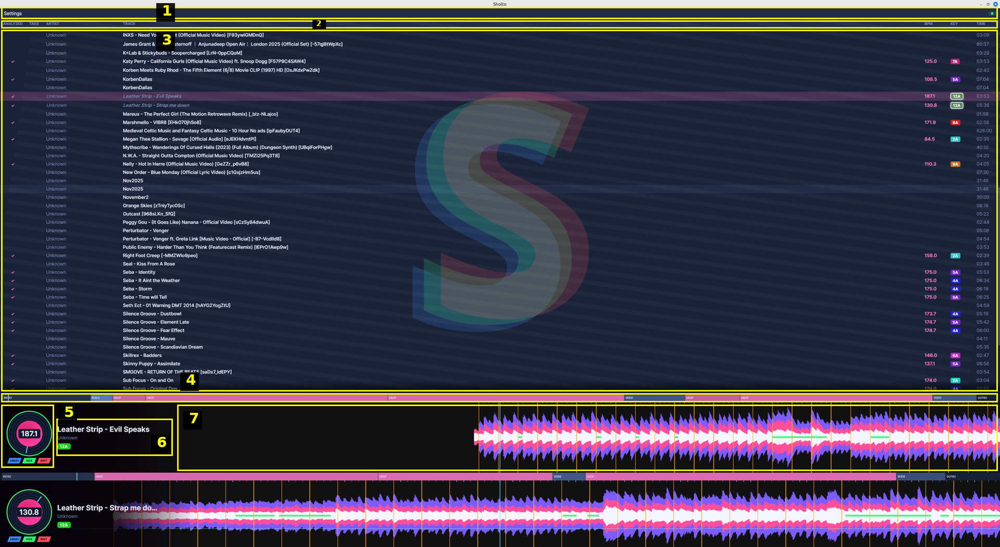

# Sholto — the guide

Every part of the screen, what you click, and what you press on the DDJ-FLX4.

## What's on screen

1. **Top bar** — the **Settings** menu and the controller dot. → [below](#top-bar)
2. **Library column headers** — ANALYZED · TAGS · ARTIST · TRACK · BPM · KEY · TIME. → [library.md](library.md#the-columns)
3. **Track list** — every track in your music folder, one row each. → [library.md](library.md)
4. **Section map** — the whole song as coloured blocks: intro, build, drop, breakdown. → [deck.md](deck.md#section-map)
5. **Disc, BPM and stem chips** — the spinning platter, its progress ring, the BPM, and DRMS / VOX / INST. → [deck.md](deck.md#stems)
6. **Track title and key chip** — what's loaded, and its Camelot key. → [deck.md](deck.md#key-chip-and-camelot)
7. **Waveform** — the scrolling track: frequency bands, beatgrid, vocals, loops, markers. → [deck.md](deck.md#waveform)

There are two decks. Deck 1 is the upper pair (4–7), Deck 2 the lower one.

## Top bar

- **Settings → Theme** — pick a colour theme; each entry shows its own colour swatches. See [themes.md](themes.md).
- **Settings → Music folder…** — choose the folder Sholto scans for music.
- **Settings → Output device…** — choose which sound card or headphones Sholto plays to. Your choice is remembered.
- **Controller dot** (far right) — green means your DDJ-FLX4 is connected. It turns red and reads **Reconnect USB** when the controller drops off; Sholto keeps trying to reconnect on its own, so if it stays red, unplug and replug the USB cable.

## Controller at a glance

| Control | What it does | More |
|---|---|---|
| Browse knob (turn) | Move the highlight up and down the track list | [library](library.md#choosing-a-track) |
| Browse knob (hold ~1 s) | Re-analyse the highlighted track from scratch | [library](library.md#analysis) |
| **LOAD 1** / **LOAD 2** | Load the highlighted track onto Deck 1 / Deck 2 | [library](library.md#loading-a-track) |
| **PLAY/PAUSE** | Start the deck; pause spins it down like a stopping turntable | [deck](deck.md#play-pause-and-the-brake) |
| Platter top (touch and turn) | Scratch. Let go and it resumes; spin it and it coasts | [deck](deck.md#the-platter) |
| Platter side ring | Fine nudge, forwards or back | [deck](deck.md#the-platter) |
| **SHIFT** + platter top | Silent fast search through the track | [deck](deck.md#the-platter) |
| **CUE** (mixer, per deck) | Send that deck to your headphones | [deck](deck.md#cue-and-headphones) |
| **SHIFT** + **CUE** | Restart the track from the very beginning | [deck](deck.md#cue-and-headphones) |
| **MASTER CUE** | Fold the main mix into your headphones too | [deck](deck.md#cue-and-headphones) |
| **4 BEAT / EXIT** | Start a 4-bar loop on the beat; press again to exit | [deck](deck.md#loops) |
| **½×** / **2×** | Halve or double the running loop | [deck](deck.md#loops) |
| **HOT CUE** / **PAD FX1** | Switch that deck's pads between the two pages | [deck](deck.md#stems) |
| Pads **1 / 2 / 3** (HOT CUE page) | Mute drums / vocals / instrumental | [deck](deck.md#stems) |
| Pad **1** (PAD FX1 page) | Beat-synced echo on and off | [deck](deck.md#echo) |
| Stem-level button (hold) + EQ knobs | Ride each stem's level instead of the EQ | [deck](deck.md#stem-levels) |
| **EQ HI / MID / LOW** | Three-band isolator — full cut at the bottom | [deck](deck.md#eq-filter-and-faders) |
| **FILTER** knob | Low-pass to the left, high-pass to the right, off in the middle | [deck](deck.md#eq-filter-and-faders) |
| Channel faders / crossfader | Deck volume and the blend between decks | [deck](deck.md#eq-filter-and-faders) |
| Tempo fader | Speed the deck up or down | [deck](deck.md#tempo) |
| **SHIFT** + **BEAT SYNC** | Cycle the tempo range: ±6 → ±10 → ±16 → WIDE | [deck](deck.md#tempo) |
| **SHIFT** + ← / → arrows | Nudge the beatgrid one beat earlier or later | [deck](deck.md#beatgrid) |
| **BEAT SYNC** (on its own) | Nothing yet — beat sync isn't built | — |

Transport is controller-only: nothing on screen starts, stops, or jumps the music.

## Keyboard at a glance

| Key | What it does |
|---|---|
| **Space** | Open search — tracks, crates and tags at once |
| **↑ / ↓** | Move up and down the track list |
| **1** / **2** | Load the highlighted track onto Deck 1 / Deck 2 |
| **Enter** | Open the actions menu for the highlighted track |
| **P** / **Shift + P** | Play or pause Deck 1 / Deck 2 |
| **M** / **Shift + M** | Drop a marker on Deck 1 / Deck 2 at the current spot |
| **G** | Open the tempo and beatgrid tuner on the deck you're working on |
| **↑ / ↓** (tuner open) | BPM ±0.1 — hold **Shift** for ±1 |
| **← / →** (tuner open) | Slide the grid ±10 ms — hold **Shift** for ±1 beat |
| **Esc** | Close the tuner or a menu; otherwise clear a crate or tag filter |

## Themes

Sholto ships with eleven colour themes, picked from **Settings → Theme**. A theme
recolours the whole app — the library, the section map, and the waveform's bands,
grid, playhead, markers and loop. You can write your own and drop it in a folder;
see [themes.md](themes.md).
